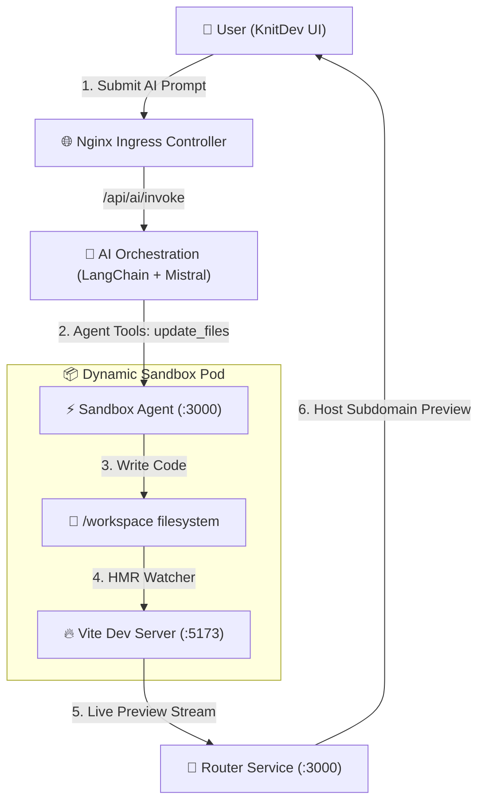

# 🚀 KnitDev Architecture & Frontend Flow Guide

A high-performance, Kubernetes-native AI Sandbox platform that generates, runs, and live-previews React frontend applications in real time.

---

## 🧭 System Architecture & Flow



---

## ⚡ The 4-Step Lifecycle (Short & Easy to Remember)

### 1️⃣ Sandbox Spawn (`POST /api/sandbox/start`)
- Request hits `sandbox-server`.
- Creates a dedicated Kubernetes Pod (`sandbox-pod-${sandboxId}`) and ClusterIP Service (`sandbox-service-${sandboxId}`).
- `initContainers` seed the project template into `/workspace`.

### 2️⃣ AI Generation (`POST /api/ai/invoke`)
- Request streams Server-Sent Events (`event: log`, `event: final`, `event: done`).
- LangChain agent executes `list_files` ➔ `read_files` ➔ plans changes ➔ calls `update_files`.

### 3️⃣ File Mutation (`PATCH /update-files`)
- `sandbox-agent` receives code payload and normalizes target path via `resolveWorkspacePath()`.
- Code is saved directly to `/workspace/src/App.jsx`.

### 4️⃣ Instant HMR Preview (`http://${sandboxId}.preview.127.0.0.1.nip.io`)
- Vite dev server detects file change in `/workspace/src`.
- Router proxies preview iframe and WebSockets cleanly back to the frontend UI.

---

## ⚠️ Errors Encountered & Fixed (The Hall of Fame)

> [!IMPORTANT]
> The following 5 major issues were identified and permanently resolved across the codebase:

### 🛠️ 1. `502 Bad Gateway` on Preview Iframe
* **Root Cause**: Vite 6 strict host validation blocked Kubernetes readiness probes (`http://<pod-ip>:5173/`) with `403 Forbidden`. K8s marked pods `NOT READY` and removed them from Service endpoints.
* **Fix**: Added complete server configuration in [frontend/vite.config.js](file:///c:/Capstone/frontend/vite.config.js) & [sandbox/template/vite.config.js](file:///c:/Capstone/sandbox/template/vite.config.js):
  ```javascript
  server: {
    host: '0.0.0.0',
    port: 5173,
    strictPort: true,
    allowedHosts: true,
    cors: true,
    hmr: { clientPort: 80 }
  }
  ```

---

### ⏱️ 2. "Operation Abort Time Limit Exceeded" (5s Proxy Timeout)
* **Root Cause**: `sandbox/router/src/app.js` hardcoded a 5-second timeout (`timeout: 5000`) on `http-proxy-middleware`, cutting off streaming AI requests prematurely.
* **Fix**: Updated `timeout` and `proxyTimeout` to `600000` (10 minutes) in [sandbox/router/src/app.js](file:///c:/Capstone/sandbox/router/src/app.js).

---

### 💥 3. Router Deployment Pod Crashes (`Progressing 0/1`)
* **Root Cause**: In `sandbox/router/src/app.js`, `server.on('upgrade')` called `proxy.upgrade()`. `http-proxy-middleware` v4 does not have `.upgrade()`, throwing an uncaught `TypeError` that crashed Node.
* **Fix**: Added safe function checks (`typeof proxy.upgrade === 'function'`) and a `try...catch` wrapper in [sandbox/router/src/app.js](file:///c:/Capstone/sandbox/router/src/app.js). Added process-level exception handlers in [sandbox/router/server.js](file:///c:/Capstone/sandbox/router/server.js).

---

### 🚫 4. `Error connecting to AI service stream` (CORS Policy Violation)
* **Root Cause**: `ai-orchestration` lacked CORS middleware. Browsers blocked cross-origin `POST` and preflight `OPTIONS` requests from `http://localhost:5173`.
* **Fix**: Added global CORS middleware with OPTIONS preflight handling in [ai-orchestration/src/app.js](file:///c:/Capstone/ai-orchestration/src/app.js) and `Access-Control-Allow-Origin: *` in [ai-orchestration/src/routes/agent.routes.js](file:///c:/Capstone/ai-orchestration/src/routes/agent.routes.js).

---

### 🙈 5. Invisible Preview Changes & Mismatched Payload
* **Root Cause**: Frontend `updateFile()` sent `{ files: [...] }` instead of `{ updates: [...] }`, causing `sandbox-agent` to return `400 Bad Request`. `api.js` caught this error and fell back to a fake mock chat response (`simulateMockAiStream`).
* **Fix**: 
  1. Updated `updateFile()` payload format in [frontend/src/services/api.js](file:///c:/Capstone/frontend/src/services/api.js).
  2. Implemented `resolveWorkspacePath()` in [sandbox/agent/src/app.js](file:///c:/Capstone/sandbox/agent/src/app.js) to strip leading `/workspace/`, `/app/`, or `/` prefixes so file writes always land on `/workspace/src/...`.
  3. Removed `simulateMockAiStream()` fake fallback so real API errors are surfaced truthfully.

---

## 🛠️ Quick Reference Cheat Sheet

| Task | Command |
| :--- | :--- |
| **Run Cluster & Deploy Services** | `skaffold run` |
| **Development Watch Mode** | `skaffold dev` |
| **Rebuild Router Container** | `docker build -t router:latest ./sandbox/router` |
| **Rebuild Agent Container** | `docker build -t agent:latest ./sandbox/agent` |
| **Rebuild AI Orchestration Container** | `docker build -t ai-orchestration:latest ./ai-orchestration` |
| **Rebuild Sandbox Template Image** | `docker build -t template:latest ./sandbox/template` |

---

## 📌 Endpoint Summary

| Endpoint | Target Service | Purpose |
| :--- | :--- | :--- |
| `POST /api/sandbox/start` | `sandbox-service:80` | Spawn new Kubernetes sandbox Pod + Service |
| `POST /api/ai/invoke` | `ai-service:80` | Stream AI code generation logs & response |
| `GET /list-files` | `sandbox-agent:3000` | List project workspace files |
| `GET /read-files` | `sandbox-agent:3000` | Read project workspace files |
| `PATCH /update-files` | `sandbox-agent:3000` | Save/update file content in `/workspace` |
| `*.preview.127.0.0.1.nip.io` | `router-service:80` | Reverse proxy for Vite live preview (:5173) |


Integrate these apis

POST http://localhost/api/sandbox/project
which accpet data like this
{
  "title":"test"
}
and return response like this
{
    "message": "Project created successfully",
    "project": {
        "user": "6a7171457dd4d287893fbc70",
        "title": "test",
        "_id": "6a743a9f516bfee46b79d68d",
        "__v": 0
    }
}

POST http://localhost/api/sandbox/start
which accpet data like this
{
    "projectId": "6a743a9f516bfee46b79d68d"
}
and return response like this
{
    "message": "Sandbox started successfully!",
    "sandboxId": "019fd605-3171-730c-b950-48ec286eb072",
    "previewUrl": "http://019fd605-3171-730c-b950-48ec286eb072.preview.127.0.0.1.nip.io",
    "agentUrl": "http://019fd605-3171-730c-b950-48ec286eb072.agent.127.0.0.1.nip.io"
}

GET http://localhost/api/sandbox/projects
it return response like this
{
    message: 'Project retrived successfully',
    projects
}

all these apis are protected so mkae sure to include credentials well when making api