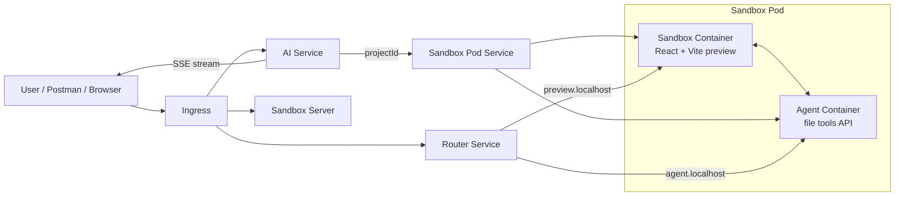
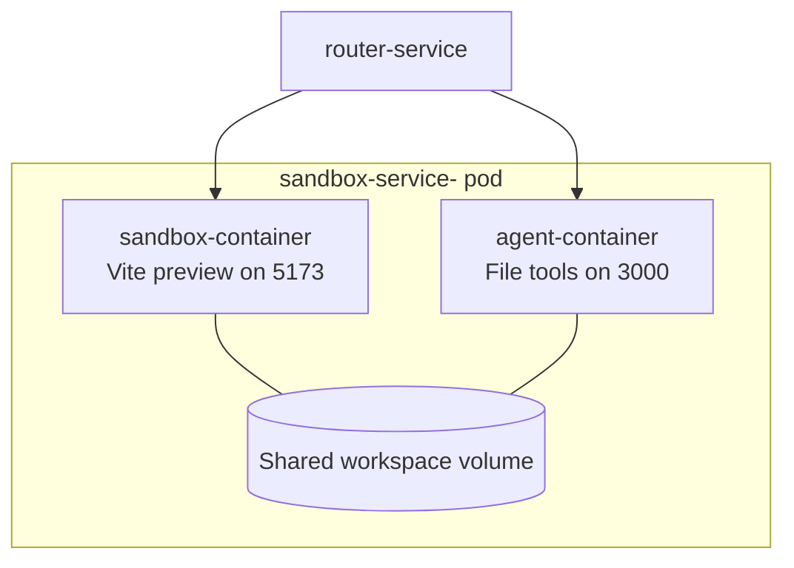
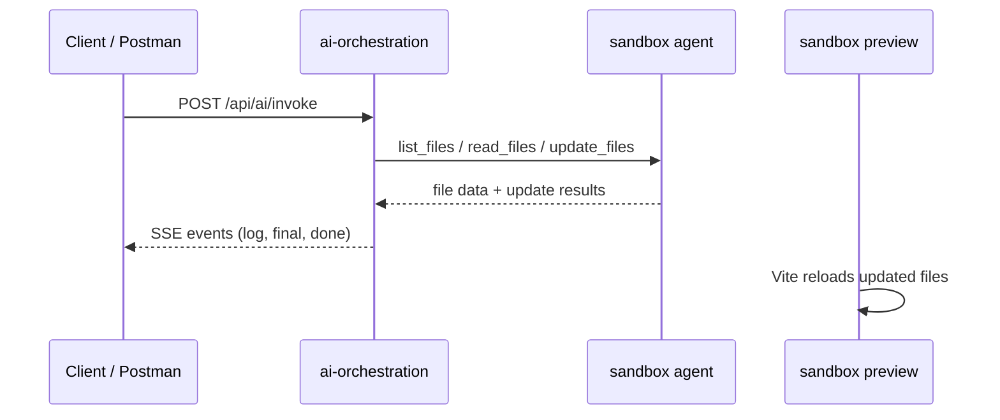
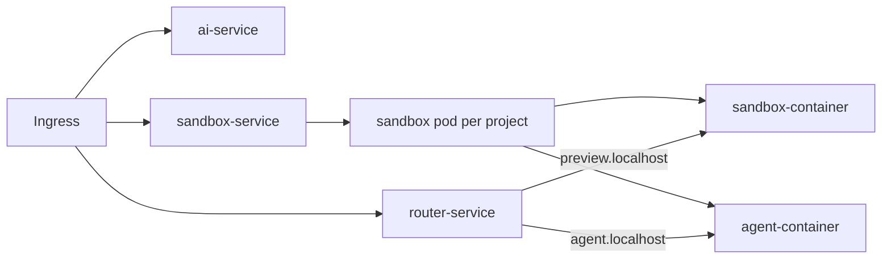

# Capstone AI Orchestration

A small but complete system that lets an AI agent inspect a sandboxed React project, edit files through tools, and stream progress back to the client while Kubernetes keeps the preview environment isolated.

<details open>
<summary>Quick Map</summary>

- `ai-orchestration` is the AI service that receives prompts and streams responses.
- `sandbox/server` creates preview pods and services for each project.
- `sandbox/router` routes `preview.localhost` and `agent.localhost` traffic to the right pod.
- `sandbox/agent` exposes file tools like `list-files`, `read-files`, `update-files`, and `create-files`.
- `sandbox/template` is the React app cloned into every new sandbox pod.
- `k8s` contains the deployment, service, and ingress manifests.

</details>

## What We Built

This project became a mini AI coding platform:

1. A user sends a prompt to the AI endpoint.
2. The AI agent reads the sandbox workspace through tool APIs.
3. The agent updates files in the preview app.
4. Kubernetes keeps every sandbox isolated in its own pod and service.
5. The browser preview shows the live React app for that sandbox.

<details>
<summary>In plain English</summary>

Think of it like this:

- The AI is the developer.
- The sandbox is the temporary project folder.
- The agent service is the tool belt.
- Kubernetes is the building manager that gives every project its own room.
- The preview URL is the window into that room.

</details>

## Architecture



### How the pod is wired

Each project gets one pod with two containers:

- `sandbox-container`
- `agent-container`

They share the same pod network and the same workspace volume, so the agent can edit files and the preview container can instantly serve them.



## Request Flow



## SSE

The AI route uses Server-Sent Events at [`src/routes/agent.routes.js`](ai-orchestration/src/routes/agent.routes.js).

Why SSE is useful here:

- The model can send progress as it works.
- Tool activity can be streamed in real time.
- The client receives a final answer without waiting for the whole task to finish silently.

What the stream sends:

- `log` for tool progress
- `final` for the final model response
- `done` when the run is complete

Example shape:

```text
event: log
data: Reading files...

event: final
data: The project is ready...

event: done
data: [DONE]
```

> If you open this endpoint in Postman, it can show the event stream, but a browser preview is still the best place to see the final app state.

## Workflow

<details open>
<summary>End-to-end workflow</summary>

1. A request hits `POST /api/ai/invoke`.
2. `ai-orchestration` starts the LangChain agent.
3. The agent gets the sandbox `projectId`.
4. It calls `list_files` to inspect the project.
5. It calls `read_files` on the files it needs.
6. It calls `update_files` to write changes.
7. The sandbox preview container serves the updated app.
8. The AI service streams status back through SSE.

</details>

<details>
<summary>Preview flow</summary>

1. `sandbox/server` creates a new pod and service.
2. `sandbox/router` maps `*.preview.localhost` to the preview container.
3. `sandbox/router` maps `*.agent.localhost` to the file-tool container.
4. The shared volume keeps both containers in sync.
5. Vite refreshes the page when files change.

</details>

## Main Pieces

| Area | File | Role |
| --- | --- | --- |
| AI API | `ai-orchestration/src/app.js` | Mounts the AI routes |
| SSE route | `ai-orchestration/src/routes/agent.routes.js` | Streams logs and final output |
| Agent prompt | `ai-orchestration/src/agents/code.agent.js` | Tells the model how to behave |
| Sandbox server | `sandbox/server/src/app.js` | Creates pods and services |
| Pod spec | `sandbox/server/src/kubernetes/pod.js` | Builds the two-container pod |
| Service spec | `sandbox/server/src/kubernetes/service.js` | Exposes preview and agent ports |
| Router | `sandbox/router/src/app.js` | Routes hostnames to the right pod |
| Template app | `sandbox/template` | Starting React app copied into each sandbox |
| Cluster config | `k8s/*.yml` | Deploys the whole system |

## Why the Preview Kept Breaking

We ran into repeated `react-scroll` import errors because generated components referenced a package that was not consistently installed in the sandbox image.

The fix path we used was:

- inspect the files inside the live sandbox
- remove or replace the missing import
- verify the updated file again
- keep the preview app on native anchors and buttons where possible

In simple terms: if a package is not guaranteed to exist, the safest fix is to stop depending on it.

## Kubernetes Layout



### One project, one sandbox

Every new project gets its own sandbox ID, service, and pod. That is why the preview URL looks like:

```text
http://<sandboxId>.preview.localhost
```

And the agent URL looks like:

```text
http://<sandboxId>.agent.localhost
```

## Files To Look At First

If you want to understand the system quickly, start here:

1. [`ai-orchestration/src/routes/agent.routes.js`](ai-orchestration/src/routes/agent.routes.js)
2. [`ai-orchestration/src/agents/code.agent.js`](ai-orchestration/src/agents/code.agent.js)
3. [`sandbox/server/src/kubernetes/pod.js`](sandbox/server/src/kubernetes/pod.js)
4. [`sandbox/router/src/app.js`](sandbox/router/src/app.js)
5. [`k8s/ingress.yml`](k8s/ingress.yml)

## Useful Debug Checks

<details>
<summary>Common fixes</summary>

- If the preview says an import is missing, check the current sandbox file first.
- If Postman shows events but no normal JSON, that is expected for SSE.
- If a change does not show up in preview, refresh the browser after the file update.
- If a new dependency is added, make sure the sandbox image is rebuilt.

</details>

## Final Note

This project is not just a backend or a frontend. It is a full loop:

- prompt
- agent
- file tools
- sandbox
- preview
- feedback

That loop is the real product.